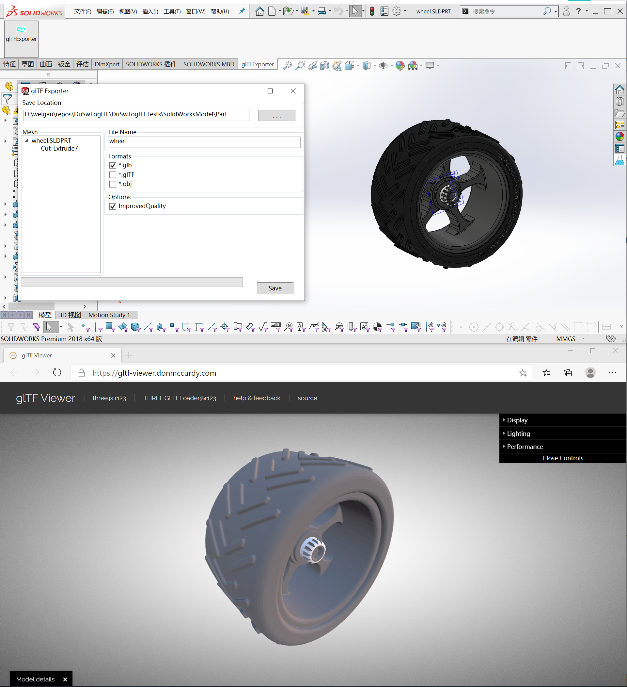
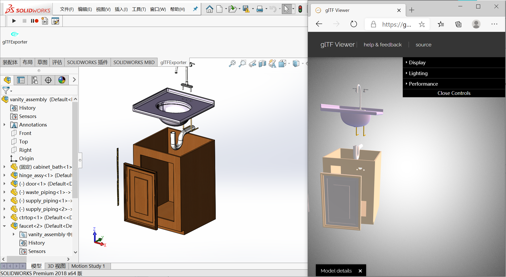

# Can solidworks export glb files?

> Yes, SolidWorks now natively supports exporting GLB files, so this repository is no longer maintained. For instructions on how to export GLB files using SolidWorks, please refer to a tutorial.

[**How to export glb files?**](https://blog.dududu.space/archives/can-solidworks-export-glb-files)

[**如何导出glb文件？**](https://blog.dududu.space/archives/how-to-export-sldworks-file-to-gltf-or-glb)

---
---
---
# DuSwToglTF

## 介绍(Introduction)

A SolidWorks Addin to save SolidWorks file as glTF formats --Solidworks插件用来将SoldiWorks文件转换为glTF格式。将sldprt和sldasm转换为gltf。

1. Support *.gltf *.glb;
2. Support PartDoc and AssemblyDoc;

Next:
1. Material Problem;
2. Texture Problem;
3. ...

## 安装包(Release)

Release:  <https://github.com/weianweigan/DuSwToglTF/releases>

## Package

 1.[MVVMLight](https://github.com/lbugnion/mvvmlight)

 2.[SharpGLTF](https://github.com/vpenades/SharpGLTF)

#### 联系我(Contact me)

email: <1831197727@qq.com>

