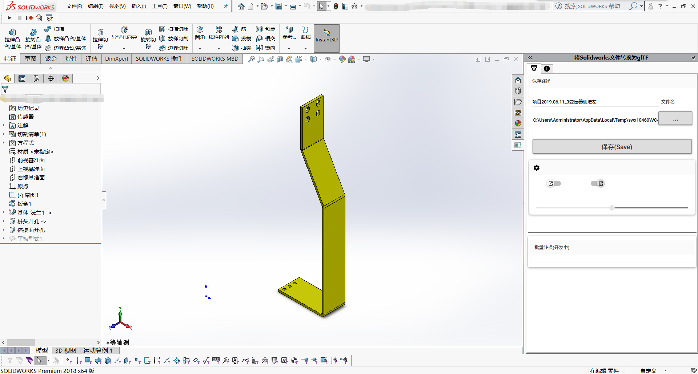
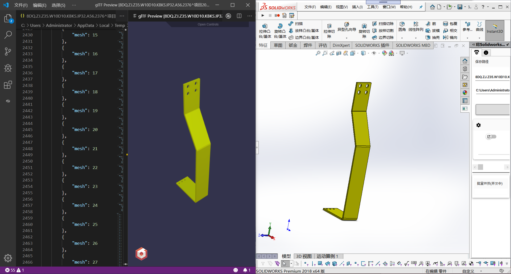
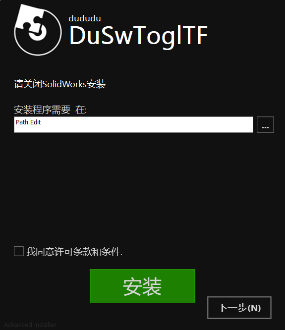

# DuSwToglTF

#### 介绍(Introduction)
A SolidWorks Addin to save as glTF --Solidworks插件用来将SoldiWorks文件转换为glTF格式。将sldprt和sldasm转换为gltf。

#### 安装包(Release)

Release:  <https://github.com/weianweigan/DuSwToglTF/releases>

[下载(DownLoad)](https://github.com/weianweigan/DuSwToglTF/releases/tag/1.0.4)

##### NuGet Package
 1.UI-MaterialDesign.wpf

 2.MVVM Mode-MVVMLight

 3.glTF wirte-SharpglTF

#####  SolidWoreks Interop dll
1.Solidworks.Interop.SldWroks

2.SolidWorks.Interop.swconst

3.SolidWorks.Interop.swpublish

4.Solidworks.Tools

#### 联系我(Contact me)

email: <1831197727@qq.com>

